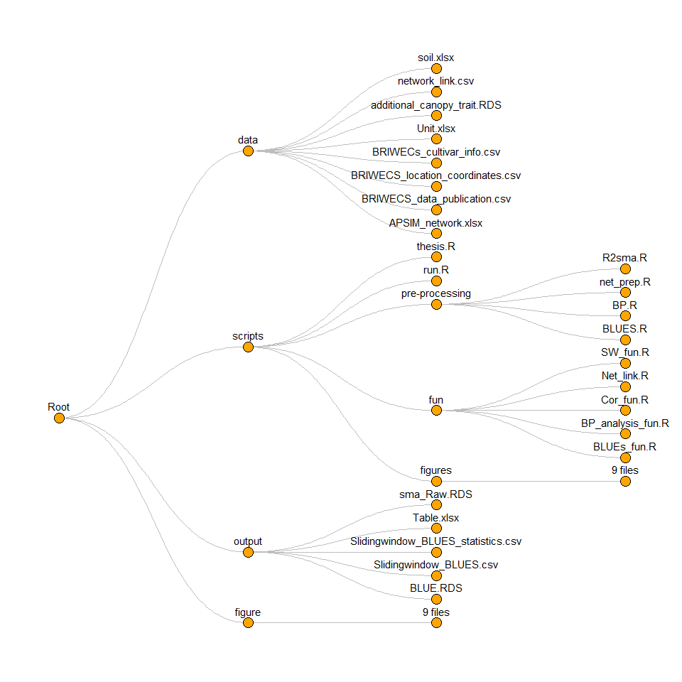

<!-- README.md is generated from README.Rmd. Please edit that file -->

<figure>

<figcaption aria-hidden="true">Breeding Innovations in Wheat for
Efficient Cropping Systems (BRIWECS).</figcaption>
</figure>

## Reproducible Data Analysis Workflow

<!--  -->

## Reproducible analysis

## insturctution

1.  open `Scientific_Data_Analysis.RProject`
2.  open `scripts/run.R`
3.  run all `Ctrl + Alt + R`

## directory tree

<!-- -->
